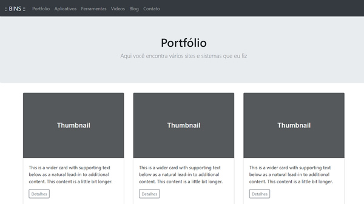

# Laravel

Este repositório contem uma aplicação Laravel que utiliza um banco de dados SQLite. Este é um modelo de layout de um portfólio pessoal feito com Bootstrap. O site é responsivo.

Aqui você pode ver o layout original (HTML)

https://github.com/dbins/responsivo

E aqui você pode ver o mesmo layout implementado no React JS

https://github.com/dbins/responsivo-react

## Instalação

- Antes de clonar o repositório, você deve ter instalado em sua máquina o PHP e o Composer.
- git clone https://github.com/dbins/laravel
- composer install
- Iniciar a aplicação digitando php artisan serve ou php -S localhost:8000 -t public/
- O site poderá ser acessado em qualquer navegador através do endereço http://localhost:8000

## Comandos utilizados

Os comandos utilizados para criar a aplicação estão no arquivo comandos.txt. Foram feitas migrations e seeds para criar o banco de dados. Também existem alguns testes unitários.

